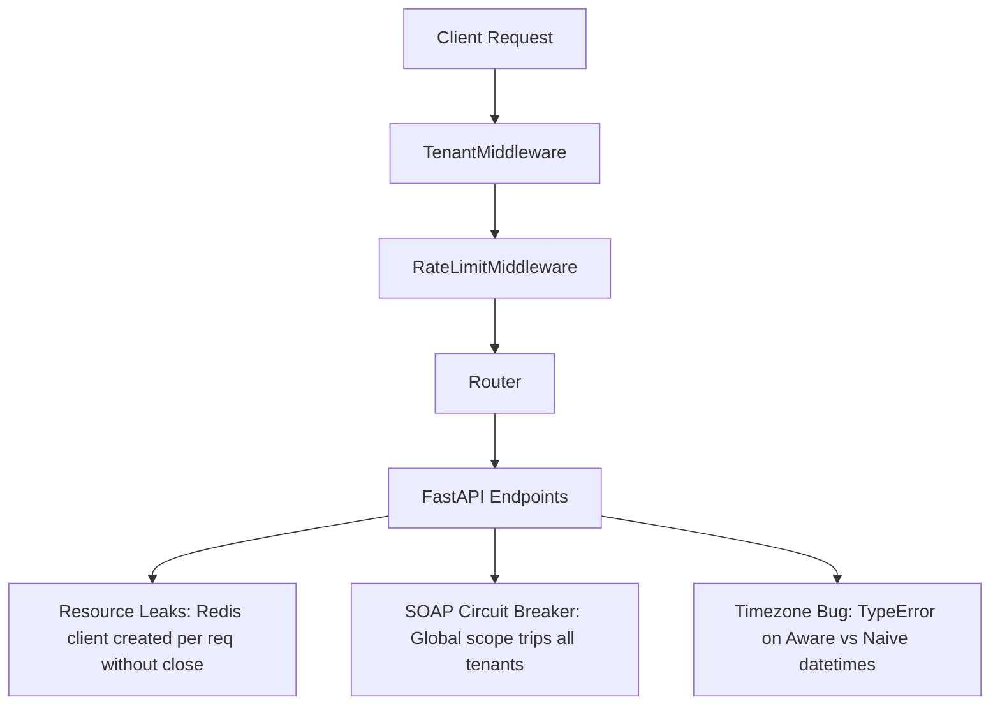

# Apex HRMS Platform — Codebase Audit Report & Remediation Plan

This audit reviews the current codebase for both the **FastAPI Backend** and the **Flutter Web Frontend**. The system is currently degraded; all integration tests are failing at the fixture setup level, and several critical runtime crashes, security vulnerabilities, and data flow failures have been identified.

---

## 1. Executive Summary
- **Backend Quality**: 5 critical runtime bugs (TypeErrors) prevent bulk import, remote commands, visitor check-in, and attendance processing from working. 
- **Frontend Quality**: The layout structure is broken (routes escape the shell navigator, hiding the sidebar), and the Setup Wizard and eSSL Server Form are non-functional (they send empty data, fail to pre-populate, and wipe database passwords on edit).
- **Security & Performance**: Database operations lack cascading indexes on 51 foreign keys. Unauthenticated routes expose entire Tenant CRUD APIs, and Redis connection pools are leaked on every request.



---

## 2. Backend Code Audit

### B1. Timezone TypeErrors in Attendance Engine
- **Files**: `backend/app/services/attendance_processor.py` (lines 333–365)
- **Problem**: `punch_in` and `punch_out` are retrieved from the database as timezone-aware UTC `datetime` objects (`DateTime(timezone=True)`). However, `_calculate_lateness` and `_calculate_early_out` create `shift_start` and `shift_end` by combining naive dates and times:
  ```python
  shift_start = datetime.combine(punch_in.date(), shift.start_time)
  ```
  Comparing `punch_in > threshold` throws a runtime `TypeError: can't compare offset-naive and offset-aware datetimes` in Python, crashing the processor 100% of the time in production.
- **Problem 2** (`backend/app/services/attendance.py`): The service bypasses the `TypeError` by replacing timezone info with UTC directly:
  ```python
  shift_start = datetime.combine(attendance_date, shift.start_time).replace(tzinfo=timezone.utc)
  ```
  This treats local shift times (e.g., 9:00 AM IST) as UTC times (9:00 AM UTC, which is 2:30 PM IST), miscalculating lateness, early-out, and overtime by the timezone offset amount (e.g., 5.5 hours).

### B2. ESSLSoapService Constructor Parameter Mismatch
- **Files**: `backend/app/services/visitor.py` (line 65) and `backend/app/services/command.py` (line 62)
- **Problem**: Both files instantiate the soap service using empty parameters:
  ```python
  soap_service = ESSLSoapService()
  ```
  However, `ESSLSoapService.__init__` requires three positional arguments:
  ```python
  def __init__(self, server_url: str, username: str, password: str, timeout: int = 30)
  ```
  This throws a `TypeError` and crashes visitor check-in and remote command execution 100% of the time. In `visitor.py`, this fails silently inside a swallowed `try-except` block, while in `command.py` it fails the command queue directly.

### B3. Redis Connection Pool Exhaustion
- **Files**: `backend/app/api/v1/endpoints/auth.py` and `backend/app/services/essl_client.py`
- **Problem**: Both modules instantiate Redis clients inside request handlers:
  ```python
  redis_client = Redis.from_url(settings.REDIS_URL, decode_responses=True)
  ```
  These connections are never closed (`await redis_client.close()`). Under load, this leaks connection descriptors and eventually crashes the Redis daemon.

### B4. Global Circuit Breaker Isolation Failure
- **File**: `backend/app/services/essl_soap.py` (line 12)
- **Problem**: `soap_breaker = CircuitBreaker(...)` is declared as a global module-level variable. In a multi-tenant SaaS environment, if Server A for Tenant 1 goes offline and fails 5 times, it opens the circuit breaker globally—blocking eSSL communication for all other healthy tenants on the platform.

### B5. Employee Bulk Import Signature Crash
- **File**: `backend/app/api/v1/endpoints/employees.py` (line 200)
- **Problem**: The controller calls:
  ```python
  count, errors = await service.bulk_import(current_user.tenant_id, content, file.filename)
  ```
  But `EmployeeService.bulk_import` only accepts 2 positional arguments:
  ```python
  async def bulk_import(self, tenant_id: uuid.UUID, file_content: bytes)
  ```
  This throws a `TypeError: bulk_import() takes 3 positional arguments but 4 were given` at runtime.

### B6. Open Tenant CRUD APIs
- **File**: `backend/app/api/v1/endpoints/tenants.py` (lines 49–78)
- **Problem**: The routes `GET /{tenant_id}`, `PUT /{tenant_id}`, and `DELETE /{tenant_id}` lack authentication dependencies. Unauthenticated clients can query, edit, or deactivate any tenant subscription.

---

## 3. Frontend UI/UX Code Audit

### F1. Setup Wizard Data Loss & Empty Payloads
- **File**: `frontend/lib/screens/setup/setup_wizard_screen.dart`
- **Problem 1**: The wizard lets users click tabs in the sidebar to skip validation and hop steps out of order.
- **Problem 2**: The step components (`_CompanyStep`, `_BranchStep`, etc.) do not write their state back to the parent widget's `_data` map, nor does the continue button harvest their controllers. As a result, the wizard sends empty JSON payloads to the backend endpoints on continue.
- **Problem 3**: Stepping backward completely wipes all input fields, requiring users to re-enter all data.

### F2. eSSL Server Form Pre-population Defect
- **File**: `frontend/lib/screens/settings/essl_server_form_screen.dart`
- **Problem**: When editing an existing server configuration (`serverId != null`), the form has no `initState` to fetch details. Fields start completely empty. Clicking update without typing everything will overwrite credentials with empty strings in the database.

### F3. Web Platform Compatibility Crash
- **File**: `frontend/lib/services/employee_service.dart` (line 124)
- **Problem**: The bulk import method uses `MultipartFile.fromFile(filePath)`. Because the frontend is built for Flutter Web, `dart:io` APIs are unavailable and this call throws an `UnsupportedError` at runtime.

### F4. Broken Layout Shell Routing
- **File**: `frontend/lib/core/router.dart`
- **Problem**: Most workspace routes (e.g., `/leaves`, `/devices`, `/reports`, `/holidays`) are declared outside the `ShellRoute`. Clicking these items from the sidebar destroys the navigation layout, hiding the sidebar and leaving users stranded on full-screen pages.

### F5. Inefficient & Failure-Prone Visitor Pass Fetching
- **File**: `frontend/lib/screens/visitors/visitor_pass_screen.dart` (line 15)
- **Problem**: To display details of a single visitor pass, the screen fetches the first 100 passes over the network and performs a local `firstWhere` search. If the pass resides beyond page 1, the app crashes with a `StateError`.

---

## 4. Database & Performance Audit

- **Misconception**: `DATABASE_AUDIT.md` incorrectly asserts: *"All foreign keys and unique constraints create implicit indexes in PostgreSQL."*
- **Fact**: PostgreSQL **does not** automatically create indexes for foreign keys. Only primary keys and unique constraints get implicit indexes.
- **Impact**: Without indexes on the 51 foreign key columns across child tables (like `attendances.employee_id` and `punch_logs.device_id`), JOIN queries and cascading deletions will perform full sequential scans, causing database locks and bottlenecking database performance.

---

## 5. Remediation Plan

```
Phase 1: Critical Hotfixes (Backend Runtime & Security)
├── Resolve timezone TypeErrors in Attendance Processor
├── Patch ESSLSoapService parameters in visitor/command services
├── Fix signature mismatch in bulk-import endpoint
└── Secure Tenant CRUD endpoints under Super Admin dependencies
Phase 2: Resource Leak & Isolation Fixes
├── Close Redis connections in auth endpoints and eSSL services
└── Move eSSL Circuit Breaker from module-scope to per-server instances
Phase 3: Frontend Data Flow & Navigation Restoration
├── Implement form value pre-population & back-state cache in Setup Wizard
├── Redefine routes as children of GoRouter ShellRoute
└── Swap MultipartFile.fromFile with fromBytes for Web compatibility
Phase 4: Database Performance & Verification
├── Implement index migrations for 51 foreign key columns
└── Fix pytest database config, run and verify the test suite
```

### Phase 1: Critical Hotfixes (Backend Runtime & Security)
1. **Timezone Arithmetic**: 
   - Refactor `AttendanceProcessor` and `AttendanceService` to localize `punch_time` to the server's timezone (using `zoneinfo`) before combining dates and times, ensuring all comparisons use timezone-aware (or timezone-naive) values consistently.
2. **SOAP Instantiation**:
   - Update `visitor.py` and `command.py` to retrieve the active `EsslServer` configuration, decrypt the password, and supply these values to the `ESSLSoapService` constructor.
3. **Bulk Import Signatures**:
   - Align parameter counts between the endpoint router and the service layer.
4. **Tenant Security**:
   - Add `get_current_superuser` dependencies to all mutation routes in `tenants.py`.

### Phase 2: Resource Leak & Isolation Fixes
1. **Redis Lifecycle**:
   - Wrap Redis client actions in `async with` context managers or initialize a single reusable connection pool on application startup.
2. **Circuit Breaker Localization**:
   - Move `soap_breaker` instantiation into `ESSLSoapService.__init__` so that each connection has its own isolated failure tracking state.

### Phase 3: Frontend Data Flow & Navigation Restoration
1. **Setup Wizard state**:
   - Configure step widgets to take state maps and update parent parameters via text change listeners. Prevent tabs in the stepper from being clicked out of sequence.
2. **GoRouter Shell**:
   - Nest all workspace routes under the `ShellRoute` section in `router.dart` so they render inside the shell body, keeping the sidebar visible.
3. **Web Files**:
   - Retrieve file bytes on the web and use `MultipartFile.fromBytes` instead of accessing local paths.

### Phase 4: Database Performance & Verification
1. **Index Migrations**:
   - Generate an Alembic migration script containing indexes for all foreign key columns.
2. **Test Environment**:
   - Correct the local postgres user password or establish local database tests to verify behavior end-to-end.
